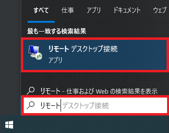
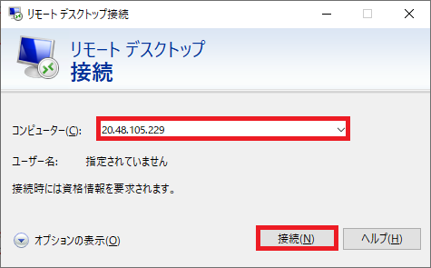
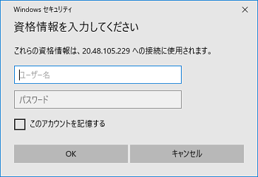
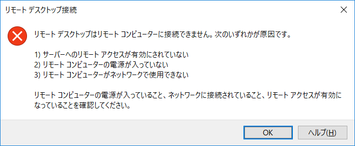

# CTC教育サービス

## Microsoft関連 コース ガイド

### ■対象コース

本ページでは以下のコースが対象となります。

| 項目                                                         |
| ------------------------------------------------------------ |
| [Windows Server システム管理（Windows Server 2019対応）](https://www.school.ctc-g.co.jp/course/P680.html) |
| [Windows Serverシステム管理　実践編](https://www.school.ctc-g.co.jp/course/P681.html) |
| [Power BI入門](https://www.school.ctc-g.co.jp/course/P608.html) |

### ■ご準備いただくもの

1. **RDP接続確認手順（※重要※）**

   演習ではリモートデスクトップ接続(RDP)を利用します。受講するPC環境からアクセスできるか確認をお願いします。

   > ※以下のキャプチャはWindows10の画面を掲載しています。

   a.Windowsのスタートメニューから「**リモート**」と検索し、「**リモートデスクトップ接続**」を選択します。

    

   

    b.リモートデスクトップ接続画面に「**20.48.105.229**」と入力し、接続をクリックします。

   　

   

   c.「**資格情報を入力してください**」と画面表示されます。これでRDP接続の確認は完了となります。

   　そのまま、画面を閉じてください。

   　

   > ※ユーザー名とパスワードの入力、サインインする必要はありません。
   >
   > ※上記画面が表示されたことにより、RDP接続が出来ていることになります。

   

   **【RDP接続が上手くいかない場合】**

   RDP接続時にエラーが表示される場合があります。

   　

   

   接続できない原因はいくつかあります。よくあるトラブルシュートは以下の通りです。

   | 項目                                                         | 詳細                                                         |
   | ------------------------------------------------------------ | ------------------------------------------------------------ |
   | 　 **ネットワークの変更** | 会社のネットワークからアクセスした場合、RDP接続を禁止する設定がファイヤーウォール等に 行われている可能性があります。別のネットワークから接続可能な場合、そちらからお試ししてご受講ください。 |
   | 　  **使用するPC変更** | 会社貸与のPCでは、RDP接続が出来ない設定が行われている場合があります。 ご自身でお持ちのPCなど、他のPCからアクセスできるかお試しください。 |
   | 　  **VPNの停止** | 業務で使用しているPCのVPNソフトが起動しているため、接続できない可能性があります。 VPNソフトを停止してお試しください。 |

   上記の対処でも接続できない、またはご用意できない場合もございます。

   その場合、AzureにはWebブラウザから仮想マシンにアクセスする機能でご提供することも可能です。

   弊社側で事前に準備する必要がございます。お手数ですが、**「受講案内メール」へのご返信**または**弊社の担当営業**へご連絡ください。

   なお、お客様にご準備いただくものはございません。受講当日はそのままご参加ください。

   ------

   

事前準備は終了となります。お忙しいところ、ご協力いただき誠にありがとうございます。

何かご不明な点がございましたら、「受講案内メール」または弊社の「担当営業」、「担当講師」へお気軽にお申し付けください。

受講当日、お会いできることを心よりお待ちしております。

