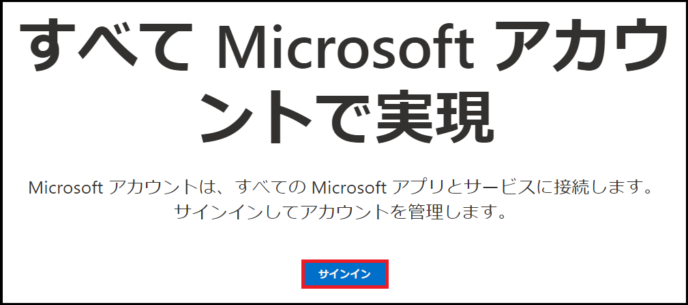
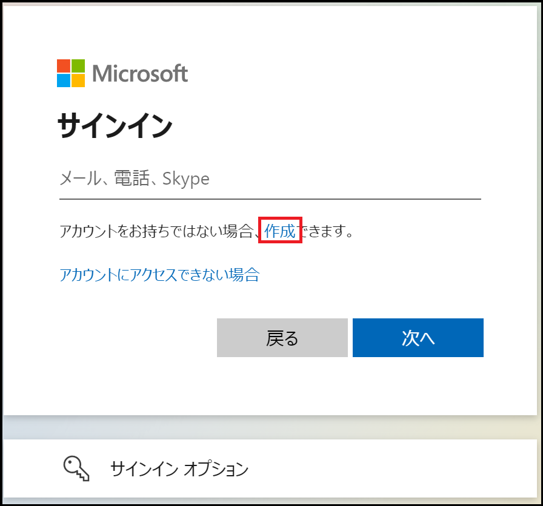
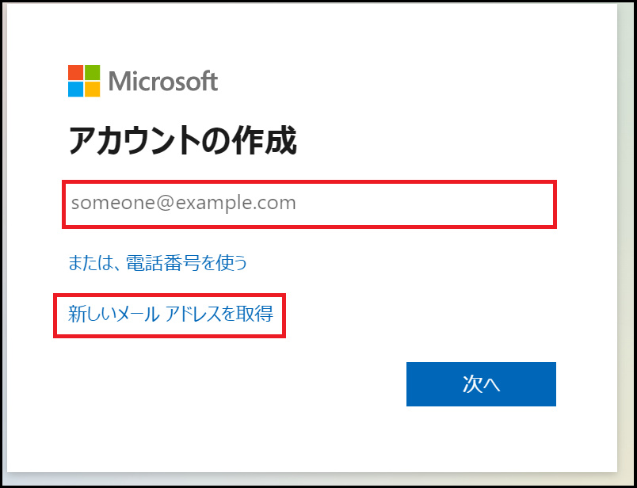
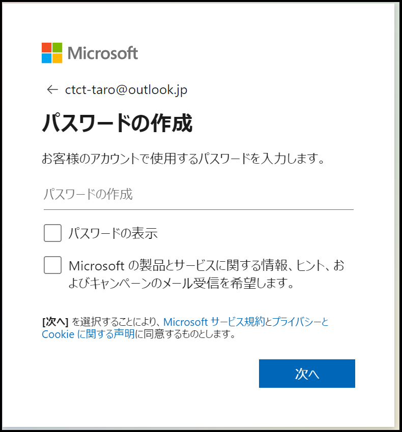
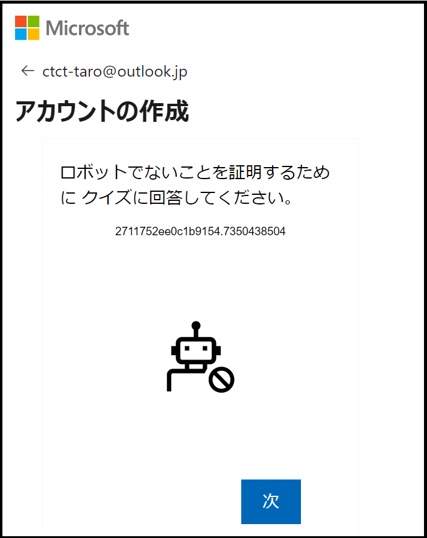
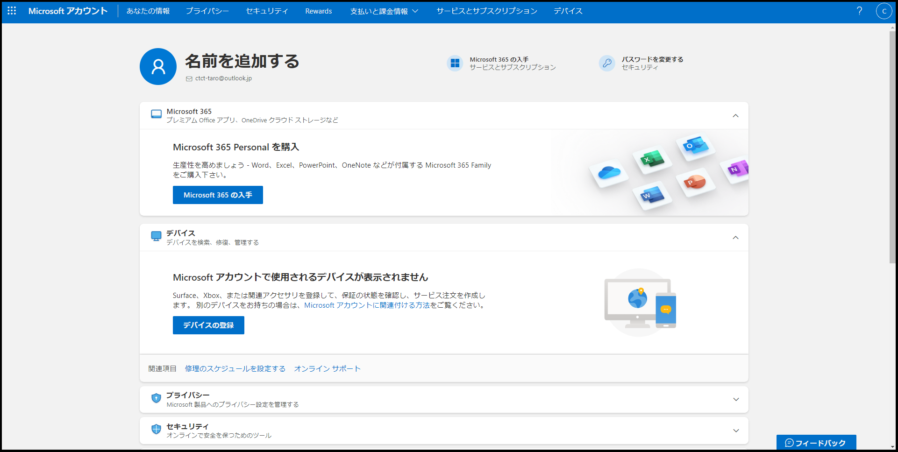
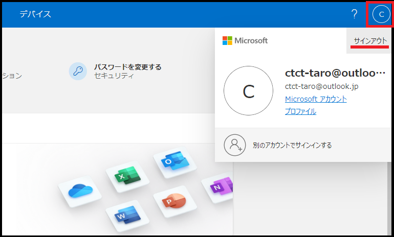

# CTC教育サービス

## Microsoft関連 コース ガイド

### ■対象コース

本ページでは以下のコースが対象となります。

| 項目                                                         |
| ------------------------------------------------------------ |
| [MS-4004 Copilot for Microsoft 365 のユース ケースを使って従業員を強化する【午前開催】](https://www.school.ctc-g.co.jp/course/P805.html) |
| [MS-4004 Copilot for Microsoft 365 のユース ケースを使って従業員を強化する【午後開催】](https://www.school.ctc-g.co.jp/course/P806.html) |
| [MS-4005 Microsoft Copilot for Microsoft 365 に対して効果的なプロンプトを作成する【午前開催】](https://www.school.ctc-g.co.jp/course/P807.html) |
| [MS-4005 Microsoft Copilot for Microsoft 365 に対して効果的なプロンプトを作成する【午後開催】](https://www.school.ctc-g.co.jp/course/P808.html) |

### ■ご準備いただくもの

1. **Microsoftアカウントの作成(※重要※)**

   Microsoft認定コースを受講する場合、「**Microsoftアカウント**」が必須となります。

   以下の手順を参考にMicrosoftアカウントをご用意ください。

   > 既にMicrosoftアカウントをお持ちの方は、ご自身のアカウントをご用意ください。

   a.Microsoftアカウント (https://account.microsoft.com/) へアクセスします。

   

   b.画面中央にある「サインイン」をクリックします。

   　

   

   c.サインイン画面で「アカウントをお持ちではない場合、作成できます。」をクリックします。

   　

   

   d.アカウントの作成画面でメールアドレスを入力して「次へ」または「新しいメールアドレスを取得」を選択します。

   | 項目                                  | 詳細                                                         |
   | ------------------------------------- | ------------------------------------------------------------ |
   | メールアドレスを入力                  | GmailやYahoo!メールなどのアドレスを利用することが可能です。 Microsoftアカウントを他のメールアドレスと統一したい場合は、こちらを選択してください。 |
   | 新しいメールアドレスを取得 ※推奨 | Microsoftアカウントとメールアドレスを取得することが可能です。 ドメインは「outlook.com」「outlook.jp」「hotmail.com」から選択できます。 Microsoftアカウントとして個別に利用したい場合は、こちらを選択してください。 |
   
   　

   

   e.パスワードを入力します。

   > ※パスワードを忘れた場合、ご自身で再設定する必要がございます。

   　

   

   f.「ロボットでないことを証明するために クイズに回答してください。」と表示されます。

   　画面に従ってパズルを解いてください。

   > ※パズルは複数パターンあります。

   　

   

   g.Microsoftアカウントの作成が完了し、Microsoftアカウントのホーム画面が表示されます。

   　

   

   h.最後に画面右上にあるアイコンをクリックし、「**サインアウト**」を行います。

   　

------

事前準備は終了となります。お忙しいところ、ご協力いただき誠にありがとうございます。

何かご不明な点がございましたら、「受講案内メール」または弊社の「担当営業」、「担当講師」へお気軽にお申し付けください。

受講当日、お会いできることを心よりお待ちしております。

