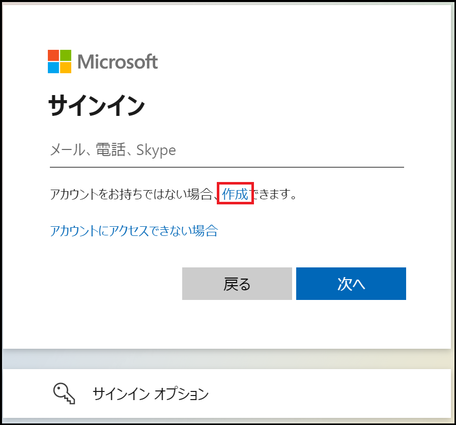
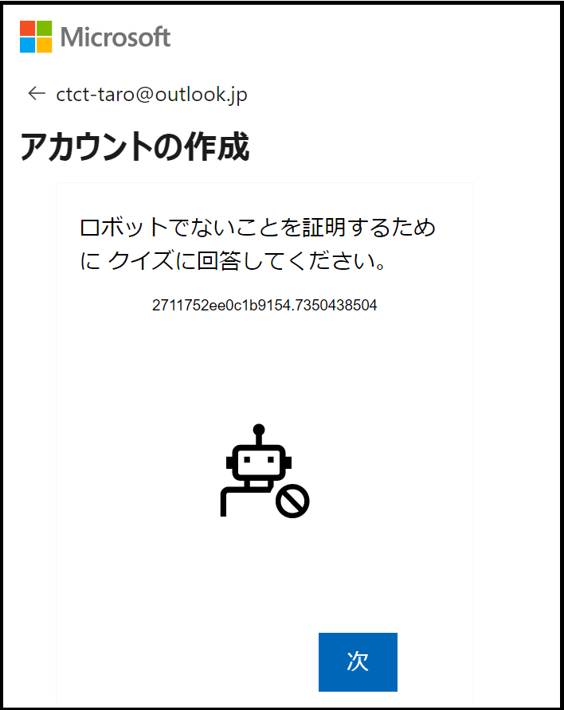

# CTC教育サービス

## Microsoft関連 コース ガイド

### ■対象コース

本ページでは以下のコースが対象となります。

| 項目                                                         |
| ------------------------------------------------------------ |
| [AZ-040 PowerShellを使用した管理の自動化](https://www.school.ctc-g.co.jp/course/P723.html) |

1. ■ご準備いただくもの

   1. **アクセス確認（※重要※)**

      本コースではインターネットで提供されるサービスを使用します。各サイトへアクセスできるネットワーク環境にてご受講ください。
      ご利用されるインターネットアクセスに制限がある場合、ラボ（演習）が実施できない場合がございます。

      | 項目      | 詳細                                     | 備考                                                         |
      | --------- | ---------------------------------------- | ------------------------------------------------------------ |
      | Skillable | https://alh.learnondemand.net/User/Login | 「**Sign In**」画面が表示できればOKです。  |

      > ※サインインする必要はありません。それぞれ入力画面が表示できればアクセス可能となります。
      >
      > ※サインインするためのアカウントは、研修内で作成または配布します。

      

   2. **Azure Portal 接続確認手順（※重要※)**

      研修ではAzureにWebブラウザからアクセスし操作を行います。受講するPC環境からアクセスできるか確認をお願いします。

      a.以下のアカウント情報とパスワードを使用して、Azure Portalにサインイン(ログイン)できるか事前確認をお願いします。

      | 項目                              | 詳細                                        |
      | --------------------------------- | ------------------------------------------- |
      | サインイン先URL(**Azure Portal**) | https://portal.azure.com                    |
      | ユーザー名                        | `azure-portal-test@ctctedu.onmicrosoft.com` |
      | パスワード                        | Pa55w.rd1234                                |

         

      b.サインイン後に「**Azure へようこそ!**」の画面が表示されましたら、正常にサインインが完了しています。

      　

      

      c.最後にサインアウトを行います。画面右上にあるユーザーアイコンをクリックし、「**サインアウト**」をしてください。

      　

      ------

      

   3. **Microsoftアカウントの作成(※重要※)**

      1. **Azure Portal 接続確認手順（※重要※)**

         演習ではリモートデスクトップ接続(RDP)を利用します。受講するPC環境からアクセスできるか確認をお願いします。

         > ※以下のキャプチャはWindows10の画面を掲載しています。

         a.Windowsのスタートメニューから「**リモート**」と検索し、「**リモートデスクトップ接続**」を選択します。

          

         

          b.リモートデスクトップ接続画面に「**20.48.105.229**」と入力し、接続をクリックします。

         　

         

         c.「**資格情報を入力してください**」と画面表示されます。これでRDP接続の確認は完了となります。

         　そのまま、画面を閉じてください。

         　

         > ※ユーザー名とパスワードの入力、サインインする必要はありません。
         >
         > ※上記画面が表示されたことにより、RDP接続が出来ていることになります。

         

         **【RDP接続が上手くいかない場合】**

         RDP接続時にエラーが表示される場合があります。

         　

         

         接続できない原因はいくつかあります。よくあるトラブルシュートは以下の通りです。

         | 項目                                                         | 詳細                                                         |
         | ------------------------------------------------------------ | ------------------------------------------------------------ |
         | 　 **ネットワークの変更** | 会社のネットワークからアクセスした場合、RDP接続を禁止する設定がファイヤーウォール等に 行われている可能性があります。別のネットワークから接続可能な場合、そちらからお試ししてご受講ください。 |
         | 　  **使用するPC変更** | 会社貸与のPCでは、RDP接続が出来ない設定が行われている場合があります。 ご自身でお持ちのPCなど、他のPCからアクセスできるかお試しください。 |
         | 　  **VPNの停止** | 業務で使用しているPCのVPNソフトが起動しているため、接続できない可能性があります。 VPNソフトを停止してお試しください。 |

         上記の対処でも接続できない、またはご用意できない場合もございます。

         その場合、AzureにはWebブラウザから仮想マシンにアクセスする機能でご提供することも可能です。

         弊社側で事前に準備する必要がございます。お手数ですが、**「受講案内メール」へのご返信**または**弊社の担当営業**へご連絡ください。

         なお、お客様にご準備いただくものはございません。受講当日はそのままご参加ください。

         ------

         

   4. **Microsoftアカウントの作成(※重要※)**

      Microsoft認定コースを受講する場合、**「Microsoftアカウント」**が必須となります。

      以下の手順を参考にMicrosoftアカウントをご用意ください。

      > 既にMicrosoftアカウントをお持ちの方は、ご自身のアカウントをご用意ください。

      

      a.Microsoftアカウント (https://account.microsoft.com/) へアクセスします。

      

      b.画面中央にある「サインイン」をクリックします。

      　

      

      c.サインイン画面で「アカウントをお持ちではない場合、作成できます。」をクリックします。

      　

      

      d.アカウントの作成画面でメールアドレスを入力して「次へ」または「新しいメールアドレスを取得」を選択します。

      | 項目                                  | 詳細                                                         |
      | ------------------------------------- | ------------------------------------------------------------ |
      | メールアドレスを入力                  | GmailやYahoo!メールなどのアドレスを利用することが可能です。 Microsoftアカウントを他のメールアドレスと統一したい場合は、こちらを選択してください。 |
      | 新しいメールアドレスを取得 ※推奨 | Microsoftアカウントとメールアドレスを取得することが可能です。 ドメインは「outlook.com」「outlook.jp」「hotmail.com」から選択できます。 Microsoftアカウントとして個別に利用したい場合は、こちらを選択してください。 |

      　

      

      e.パスワードを入力します。

      > ※パスワードを忘れた場合、ご自身で再設定する必要がございます。

      　

      

      f.「ロボットでないことを証明するために クイズに回答してください。」と表示されます。

      　画面に従ってパズルを解いてください。

      > ※パズルは複数パターンあります。

      　

      

      g.Microsoftアカウントの作成が完了し、Microsoftアカウントのホーム画面が表示されます。

      　

      

      h.最後に画面右上にあるアイコンをクリックし、「**サインアウト**」を行います。

       　

   

   ------

   

2. **Microsoft Authenticator** **インストール手順**

   Microsoft認定コースでは、ハンズオンラボを提供しております。

   一部のコースでは、ラボをご利用の際には、ラボアカウントでのサインインが必要ですが、2024年4月より、

   Microsoft社の方針により、ラボアカウントでのログインには必ず「多要素認証(MFA)」が必要となります。

   そのため、研修にご参加いただく際には、あらかじめご自身のスマートフォン（社用または私用を問わず）に

   Microsoft社の多要素認証アプリである「Microsoft Authenticator」をインストールしていただくようお願いいたします。　

   > ※既に「Microsoft Authenticator」をインストール済みの場合、事前のご準備は不要です。
   >
   > ※社用スマートフォンでインストールしている場合でも、ご利用いただけます。

   

   a.お手持ちのスマートフォンからQRリーダーを起動し、アプリインストールの画面を表示します。

    

   

   b.ストア画面が表示されましたら、インストールをしてください。

    

   

   c.インストール後にアプリを起動してください。起動後に初期設定を行います。

    

   　

   d.初期設定が完了するとホーム画面が表示されます。事前の準備はここまでとなります。

   　アプリを閉じてOKです。ご協力いただき、誠にありがとうございました。

    

   

------

事前準備は終了となります。お忙しいところ、ご協力いただき誠にありがとうございます。

何かご不明な点がございましたら、「受講案内メール」または弊社の「担当営業」、「担当講師」へお気軽にお申し付けください。

受講当日、お会いできることを心よりお待ちしております。

