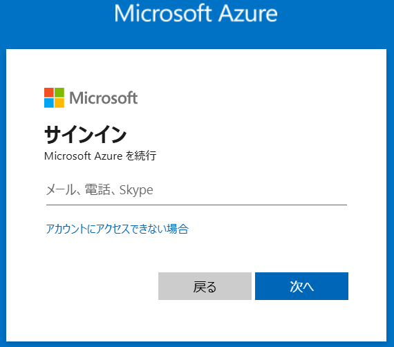
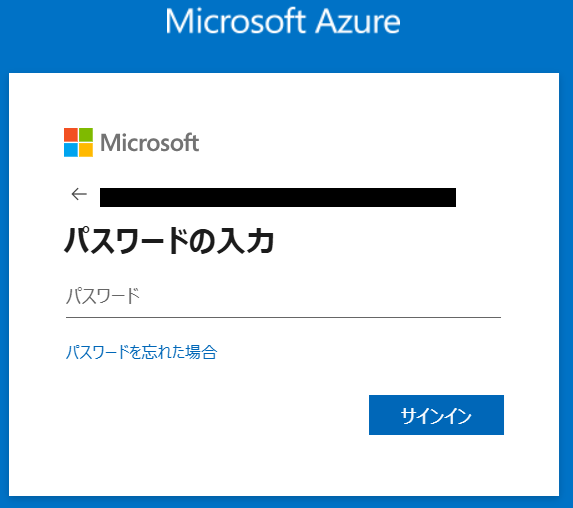
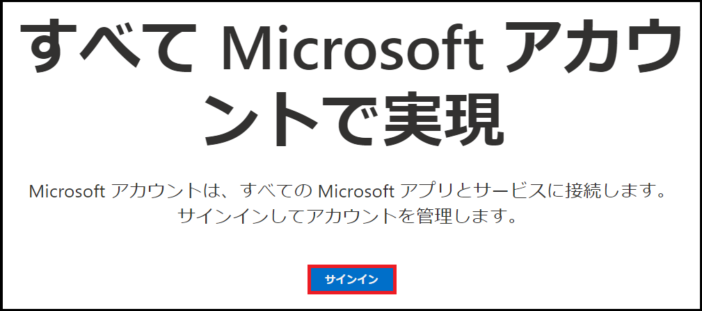
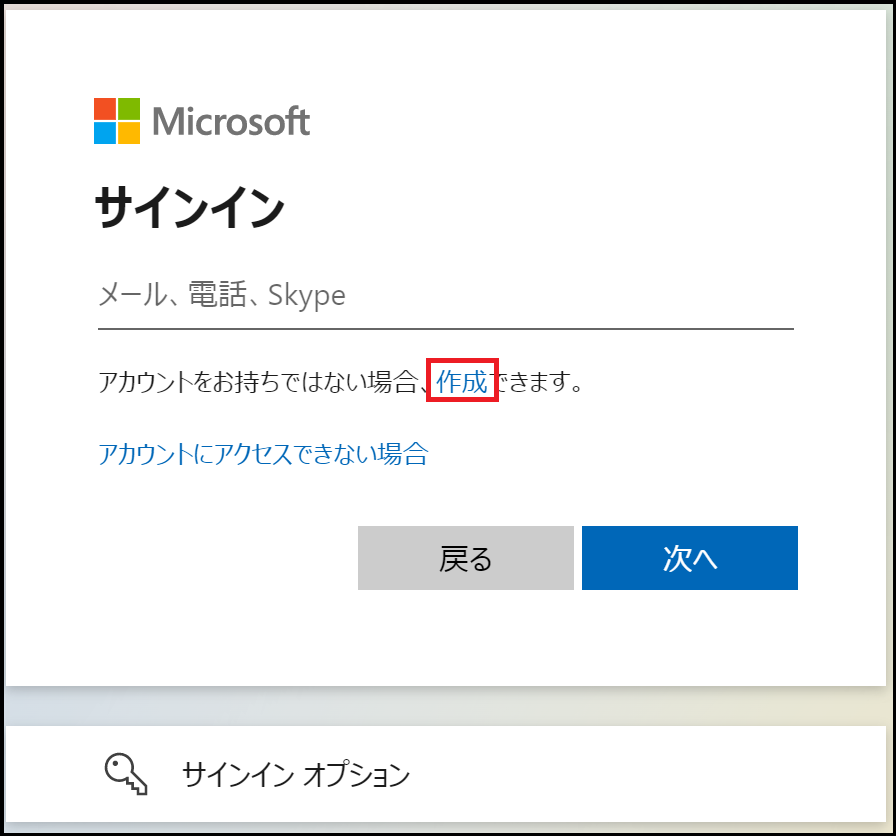
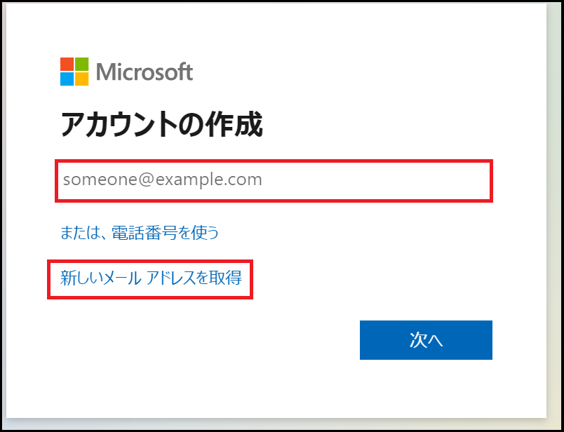
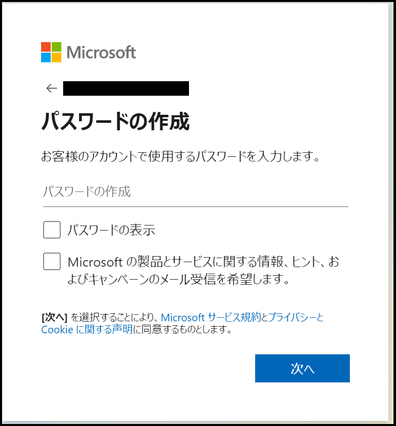
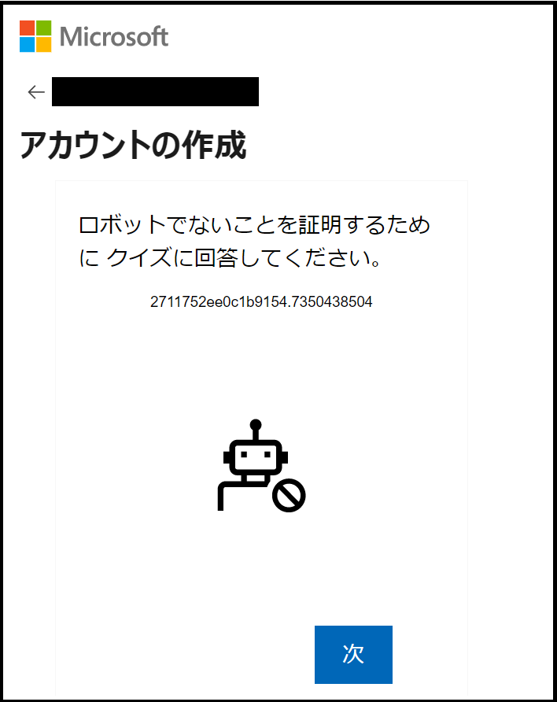
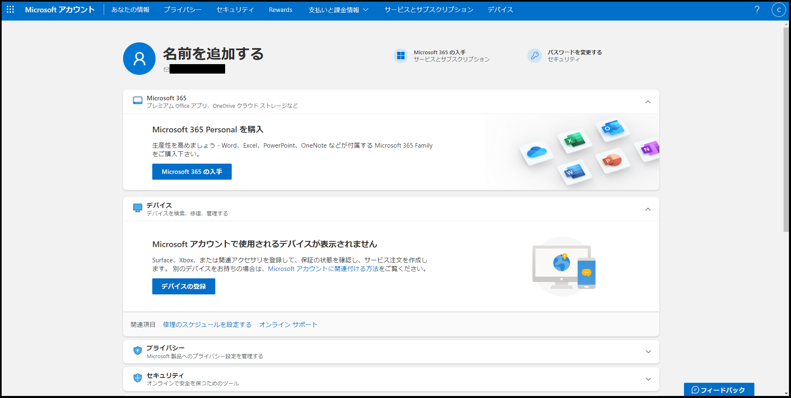
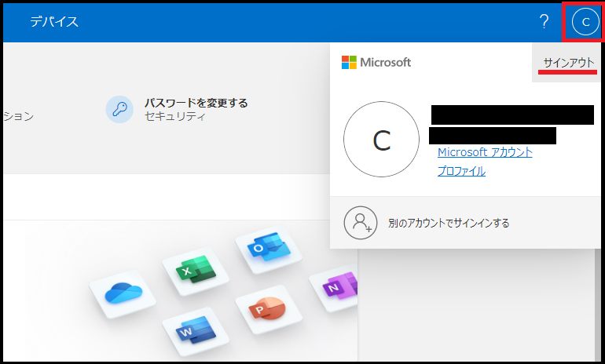

# CTC教育サービス

## Microsoft関連 コース ガイド

### ■対象コース

本ページでは以下のコースが対象となります。

| 項目                                                         |
| ------------------------------------------------------------ |
| [AZ-305 Microsoft Azure インフラストラクチャの設計](https://www.school.ctc-g.co.jp/course/P763.html) |

### ■ご準備いただくもの

1. **Azure Portal 接続確認手順（※重要※)**

   研修ではAzure PortalにWebブラウザからアクセスし操作を行います。受講するPC環境からアクセスできるか確認をお願いします。

   サインイン時に必要となるユーザー名、パスワードについては受講案内 (件名が「【CTC教育サービス】コース受講のご案内」から始まるメール) をご確認ください。

   | 項目                              | 詳細                     |
   | --------------------------------- | ------------------------ |
   | サインイン先URL(**Azure Portal**) | https://portal.azure.com |
   
      

   「サインイン要求を承認」画面が表示され Microsoft Authenticator アプリ を使用した多要素認証を求められます。その場合はブラウザーを閉じる等の手段で本手順を終了してください。確認作業は完了となります。　

   **Micorosoft Authenticatorによる多要素認証の要求ではなく、サインインが明確に拒否される（ネットワーク管理者への問い合わせを促すメッセージが表示される等）場合は、社外テナントへのサインインが制限されている可能性がございます。次の手順（2.RDP接続確認手順（※重要※)）にも同様の内容を記載しておりますが、制限のないネットワークへの切り替えなどをお試しいただくか、切り替えが難しい場合については弊社へご連絡ください。**

   ------

   

2. **Microsoftアカウントの作成(※重要※)**

   Microsoft認定コースを受講する場合、「**Microsoftアカウント**」が必須となります。

   以下の手順を参考にMicrosoftアカウントをご用意ください。

   > 既にMicrosoftアカウントをお持ちの方は、ご自身のアカウントをご用意ください。

   a.Microsoftアカウント (https://account.microsoft.com/) へアクセスします。

   

   b.画面中央にある「サインイン」をクリックします。

   　

   

   c.サインイン画面で「アカウントをお持ちではない場合、作成できます。」をクリックします。

   　

   

   d.アカウントの作成画面でメールアドレスを入力して「次へ」または「新しいメールアドレスを取得」を選択します。

   | 項目                                  | 詳細                                                         |
   | ------------------------------------- | ------------------------------------------------------------ |
   | メールアドレスを入力                  | GmailやYahoo!メールなどのアドレスを利用することが可能です。 Microsoftアカウントを他のメールアドレスと統一したい場合は、こちらを選択してください。 |
   | 新しいメールアドレスを取得 ※推奨 | Microsoftアカウントとメールアドレスを取得することが可能です。 ドメインは「outlook.com」「outlook.jp」「hotmail.com」から選択できます。 Microsoftアカウントとして個別に利用したい場合は、こちらを選択してください。 |

   　

   

   e.パスワードを入力します。

   > ※パスワードを忘れた場合、ご自身で再設定する必要がございます。

   　

   

   f.「ロボットでないことを証明するために クイズに回答してください。」と表示されます。

   　画面に従ってパズルを解いてください。

   > ※パズルは複数パターンあります。

   　

   

   g.Microsoftアカウントの作成が完了し、Microsoftアカウントのホーム画面が表示されます。

   　

   

   h.最後に画面右上にあるアイコンをクリックし、「**サインアウト**」を行います。

   　　

------

事前準備は終了となります。お忙しいところ、ご協力いただき誠にありがとうございます。

何かご不明な点がございましたら、「受講案内メール」または弊社の「担当営業」、「担当講師」へお気軽にお申し付けください。

受講当日、お会いできることを心よりお待ちしております。

