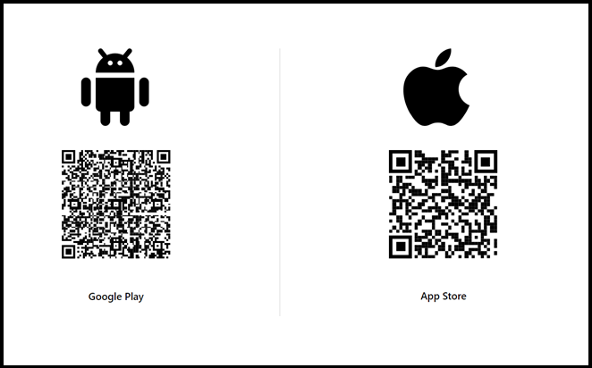

# CTC教育サービス

## Microsoft関連 コース ガイド

### ■対象コース

本ページでは以下のコースが対象となります。

| 項目                                                         |
| ------------------------------------------------------------ |
| [Microsoft Entra ID （旧称 Azure Active Directory） 入門](https://www.school.ctc-g.co.jp/course/P605.html) |

### ■ご準備いただくもの

1. **アクセス確認（※重要※)**

   本コースではインターネットで提供されるサービスを使用します。各サイトへアクセスできるネットワーク環境にてご受講ください。
   ご利用されるインターネットアクセスに制限がある場合、ラボ（演習）が実施できない場合がございます。

   | 項目                         | 詳細                                     | 備考                                                         |
   | ---------------------------- | ---------------------------------------- | ------------------------------------------------------------ |
   | Skillable                    | https://alh.learnondemand.net/User/Login | 「**Sign In**」画面が表示できればOKです。  |
   | Microsoft Entra 管理センター | https://entra.microsoft.com/             | 「**サインイン**」または「**アカウントを選択する**」 画面が表示できればOKです。  |

   > ※サインインする必要はありません。それぞれ入力画面が表示できればアクセス可能となります。
   >
   > ※サインインするためのアカウントは、研修内で作成または配布します。
   >
   > ※上記画面が表示されない場合は、 InPrivate ブラウザー ウィンドウなどでお試しください。
   >
   >  - Microsoft Edgeでは「InPrivate」ウィンドウ
   >  -  Google Chromeでは「シークレット」ウィンドウ
   >  -  Mozilla Fire Foxでは「プライベート」ウィンドウ

   

   ------

   

3. **Microsoft Authenticator** **インストール手順**

   Microsoft認定コースでは、ハンズオンラボを提供しております。

   一部のコースでは、ラボをご利用の際には、ラボアカウントでのサインインが必要ですが、2024年4月より、

   Microsoft社の方針により、ラボアカウントでのログインには必ず「多要素認証(MFA)」が必要となります。

   そのため、研修にご参加いただく際には、あらかじめご自身のスマートフォン（社用または私用を問わず）に

   Microsoft社の多要素認証アプリである「Microsoft Authenticator」をインストールしていただくようお願いいたします。　

   > ※既に「Microsoft Authenticator」をインストール済みの場合、事前のご準備は不要です。
   >
   > ※社用スマートフォンでインストールしている場合でも、ご利用いただけます。

   

   a.お手持ちのスマートフォンからQRリーダーを起動し、アプリインストールの画面を表示します。

    

   

   b.ストア画面が表示されましたら、インストールをしてください。

    

   

   c.インストール後にアプリを起動してください。起動後に初期設定を行います。

    

   　

   d.初期設定が完了するとホーム画面が表示されます。事前の準備はここまでとなります。

   　アプリを閉じてOKです。ご協力いただき、誠にありがとうございました。

    

   　

------

事前準備は終了となります。お忙しいところ、ご協力いただき誠にありがとうございます。

何かご不明な点がございましたら、「受講案内メール」または弊社の「担当営業」、「担当講師」へお気軽にお申し付けください。

受講当日、お会いできることを心よりお待ちしております。

