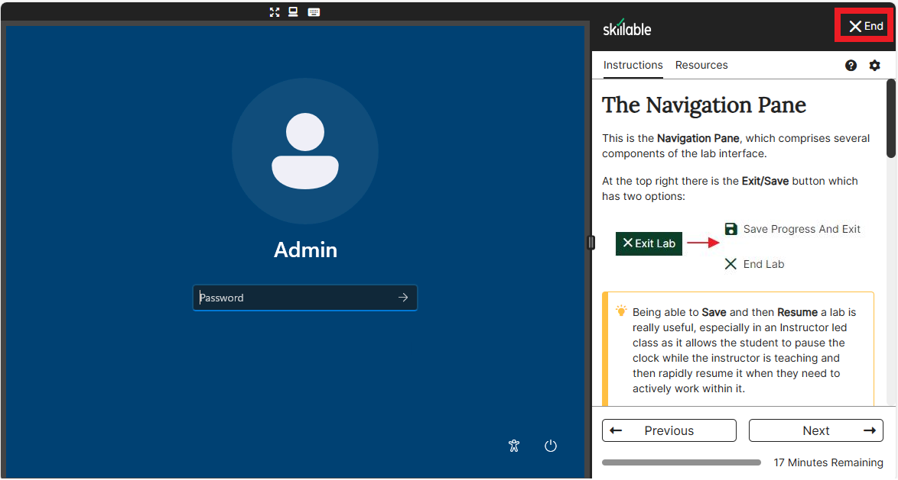
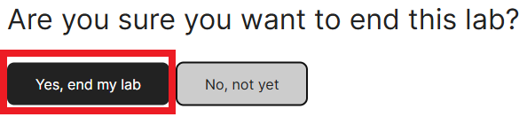
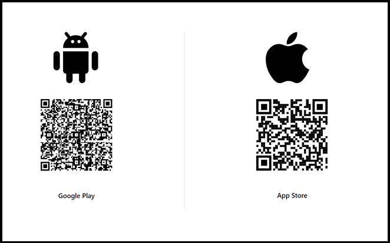
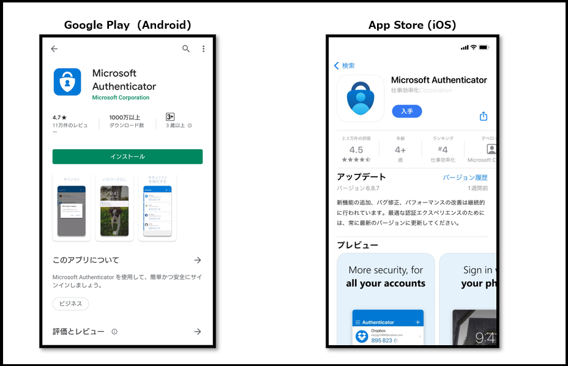
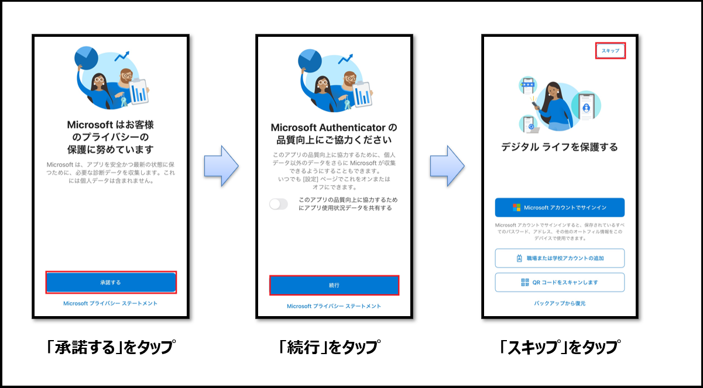
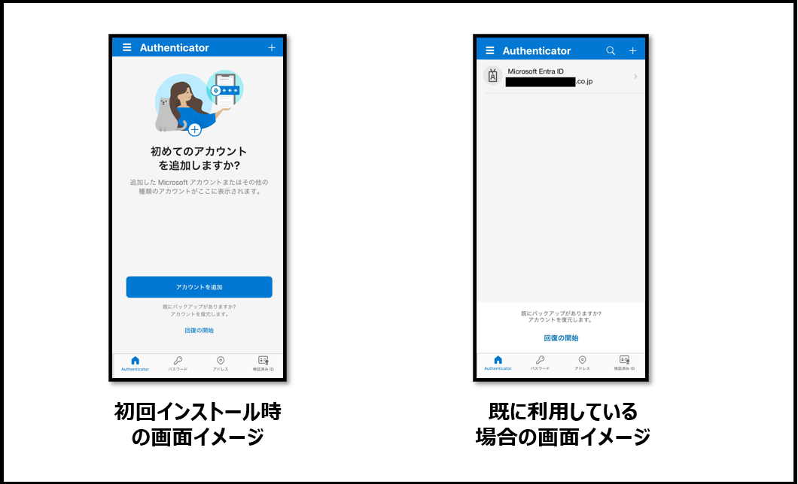

# CTC教育サービス

## Microsoft関連 コース ガイド

### ■対象コース

本ページでは以下のコースが対象となります。

| 項目                                                         |
| ------------------------------------------------------------ |
| [Microsoft 365 基礎](https://www.school.ctc-g.co.jp/course/P609.html) |

### ■ご準備いただくもの

1. **アクセス確認（※重要※)**

   本コースではインターネットで提供されるサービスを使用します。各サイトへアクセスできるネットワーク環境にてご受講ください。ご利用されるインターネットアクセスに制限がある場合、ラボ（演習）が実施できない場合がございます。

   

   本研修ではSkillable社の演習環境を使用します。以下手順をご参照の上、受講PC環境から演習環境にアクセスできることを事前にご確認ください。

   a.   下記のURLに、ブラウザーからアクセスしてください。

   https://labondemand.com/Launch/BF8A443C

   b.   少し待ち、以下のようなWindowsログイン画面が表示されましたら、接続確認は成功です。

   

   c.   時間がたてば演習環境は自動終了します。すぐ終了する場合は右上の [× End] をクリックしてください。「Are you sure you want to end this lab?」と聞かれたら「Yes, end my lab」 をクリックすると終了します。

   

   

   ------

   

   ------

3. **Microsoft Authenticator** **インストール手順**

   Microsoftコースでは、ハンズオンラボを提供しております。

   一部のコースでは、ラボをご利用の際には、ラボアカウントでのサインインが必要ですが、2024年4月より、

   Microsoft社の方針により、ラボアカウントでのログインには必ず「多要素認証(MFA)」が必要となります。

   そのため、研修にご参加いただく際には、あらかじめご自身のスマートフォン（社用または私用を問わず）に

   Microsoft社の多要素認証アプリである「Microsoft Authenticator」をインストールしていただくようお願いいたします。　

   > ※既に「Microsoft Authenticator」をインストール済みの場合、事前のご準備は不要です。
   >
   > ※社用スマートフォンでインストールしている場合でも、ご利用いただけます。

   

   a.お手持ちのスマートフォンからQRリーダーを起動し、アプリインストールの画面を表示します。

    

   

   b.ストア画面が表示されましたら、インストールをしてください。

    

   

   c.インストール後にアプリを起動してください。起動後に初期設定を行います。

    

   　

   d.初期設定が完了するとホーム画面が表示されます。事前の準備はここまでとなります。

   　アプリを閉じてOKです。ご協力いただき、誠にありがとうございました。

    

   　

   ******

   

事前準備は終了となります。お忙しいところ、ご協力いただき誠にありがとうございます。

何かご不明な点がございましたら、「受講案内メール」または弊社の「担当営業」、「担当講師」へお気軽にお申し付けください。

受講当日、お会いできることを心よりお待ちしております。

