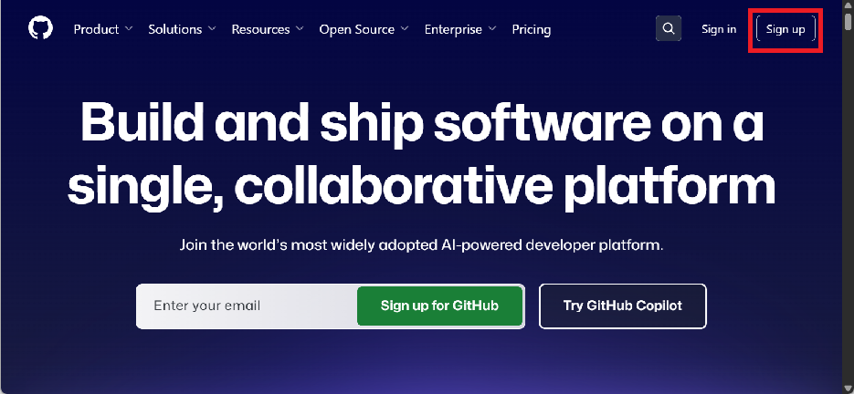
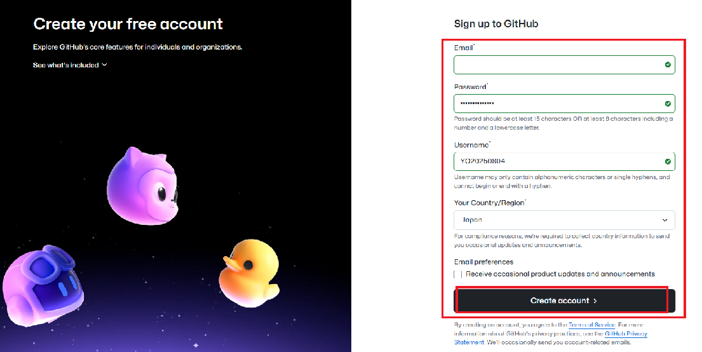
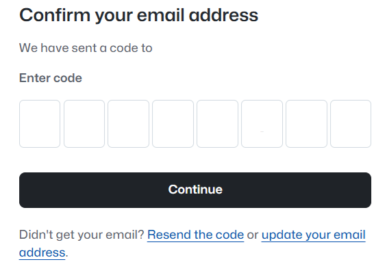
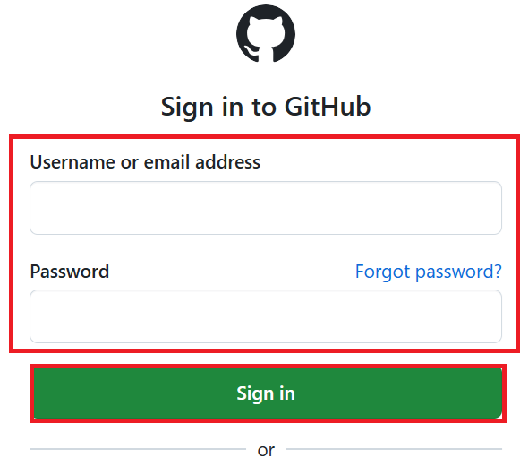

# CTC教育サービス

## GitHub アカウント事前準備

1. **GitHubにアカウントを登録する(※重要※)**

   GitHub にメールアドレスを登録してアカウントを作成します。

   > ※登録には**個人のメールアドレス**（個人スマホや個人PCのメールアドレス）をご使用ください。
   >
   > ※会社のメールアドレスはご使用にならないようお願いいたします。
   >
   > ※**個人PC**、**スマホ**、あるいは、**演習環境上**などで作業してください。
   >
   > ※新しくメールアドレスを取得したい方は、**下記「新しくメールアドレスを取得したい方へ」の手順でMicrosoftアカウントを作成してから、こちらの手順にお戻りください。**
   
   ①「<https://github.com/>」にアクセスします。

   ②画面右上の「**sign up**」をクリックします。

      

   ③「Sign up to GitHub」と表示されます。
   
   以下の必要項目を入力し「**Create account**」をクリックします。

   | 項目                      | 説明                                                           |
   | :---------------------- | :----------------------------------------------------------- |
   | **Email**               | 個人のメールアドレスを入力してください。                                     |
   | **Password**            | パスワードを入力してください。 ※パスワードは、最低15文字以上、または数字と小文字を含む8文字以上でなければなりません。 |
   | **Username**            | ユーザー名を入力してください。公開される表示名となります。                       |
   | **Your Country/Region** | 所属する国または地域を選択してください。                                         |
   | **Email preferences**   | 定期的な製品更新やお知らせを受け取るかどうかを選択します。チェックは不要です。                |

   

   ④ 画面が切り替わり、パズルを解く画面が表示されます。
      
      指示に従いパズルを解いてください。パズルを解くと「**Confirm your email address**」と表示され、登録したメールアドレスへ確認コードが送信されます。

   ⑤ GitHubから届いた確認コードを入力し「**Continue**」をクリックします。
   

   ⑥登録が完了すると「Sign in to GitHub」が表示されます。

      メールアドレスとパスワードを入力し、「**sign in**」をクリックします。GitHubへのサインインが完了します。

      

**【メールアドレスをお持ちでない方・新しくメールアドレスを取得したい方へ】**
   Microsoftアカウントを作成することで、無料でメールアドレス（Outlook）を取得できます。
   以下の手順を参考にメールアドレスをご用意ください。

   > ※既に個人のメールアドレスをお持ちの方は、この手順は不要です。

   a. Microsoftアカウント（[https://account.microsoft.com/](https://account.microsoft.com/)）へアクセスします。

   b. 画面中央にある「**サインイン**」をクリックします。

   

   c. サインイン画面で「**アカウントをお持ちではない場合、作成できます。**」をクリックします。

   

   d. アカウントの作成画面で「**新しいメールアドレスを取得**」を選択します。

   | 項目 | 詳細 |
   | ---- | ---- |
   | **新しいメールアドレスを取得** | Microsoftアカウントとメールアドレスを取得することが可能です。 ドメインは「outlook.com」「outlook.jp」「hotmail.com」から選択できます。 |

   

   e. パスワードを入力します。

   > ※パスワードを忘れた場合、ご自身で再設定する必要がございます。

   

   f. 「**ロボットでないことを証明するためにクイズに回答してください。**」と表示されます。画面に従ってパズルを解いてください。

   > ※パズルは複数パターンあります。

   

   g. Microsoftアカウントの作成が完了し、ホーム画面が表示されます。取得したメールアドレスをGitHubの登録にご使用ください。

   

   ------
------

事前準備は終了となります。